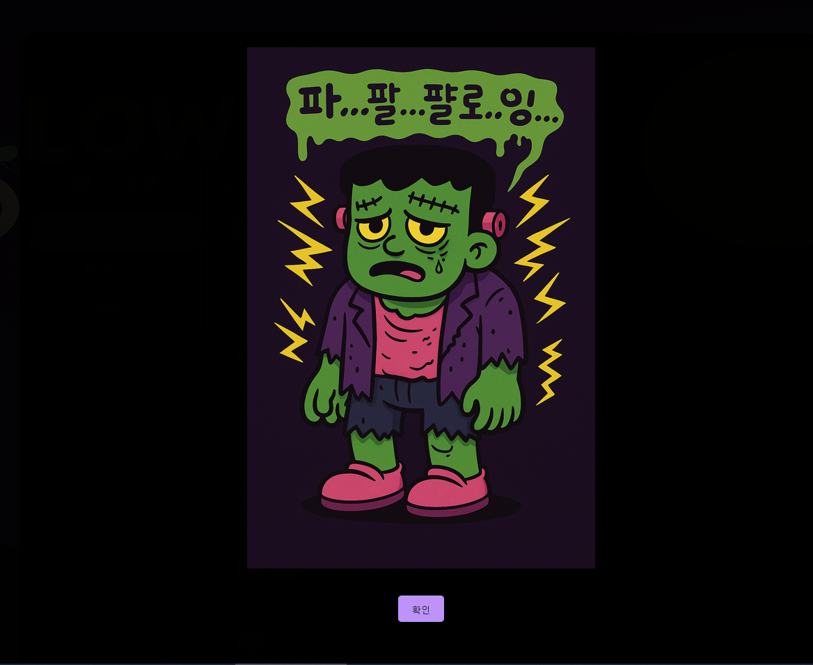

# 🎃 React + Express Server를 이용한 SNS 만들기

이 프로젝트는 **React + Express + MySQL 기반**의 **미니 SNS**입니다.

할로윈 몬스터 캐릭터를 **배경, 알림 메세지**에 활용하여 재미를 더했습니다.

---

## 📸 미리보기

**할로윈 카툰 느낌의 배경과 캐릭터**

  

---

## 🛠️ 사용 기술

* **Frontend**: React, MUI
* **Backend**: Node.js, Express, JWT, Bcrypt
* **Database**: MySQL

---

## 🧩 주요 기능

* ✅ 회원가입 / 로그인 (JWT 인증)
* ✅ 피드 작성 / 삭제 / 이미지 첨부
* ✅ 댓글 / 좋아요 / 팔로우
* ✅ 알림 기능 (맨션 알림)
* ✅ 마이페이지 프로필 수정
* ✅ 할로윈 테마 UI 적용

---

## 💻 기능 설명

📝 메인 페이지 / 로그인

 - JWT 인증을 이용해 로그인 상태를 유지
   

   

📜 피드 리스트

 - 추천 피드(좋아요와 댓글개수 기준)와 팔로워 목록
   

  

📰 피드 등록 & 이미지 업로드

 - 게시물 작성과 이미지 첨부 기능 지원

   

💬 댓글 / 좋아요 / 맨션

 - 댓글 작성, 좋아요는 할로윈 호박 불빛으로 표현. 맨션달기에 아이디 자동 검색 및 닉네임 표신

  

🧑‍🤝‍🧑 팔로우 추가 / 팔로워 피드 보기

 - 관심 있는 사용자를 팔로우하고 피드 확인

  

🎃 알림 기능

 - 맨션 알림과 연동된 게시글

  

